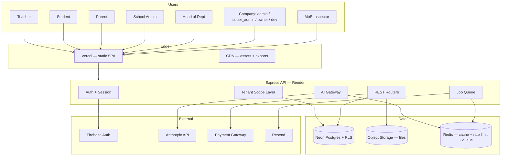
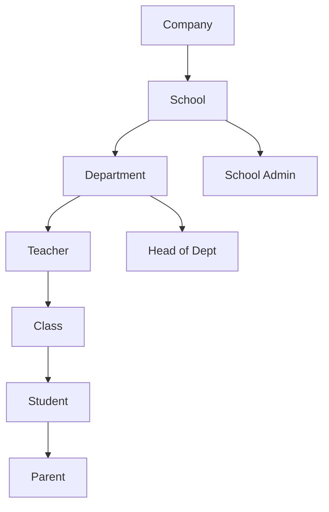
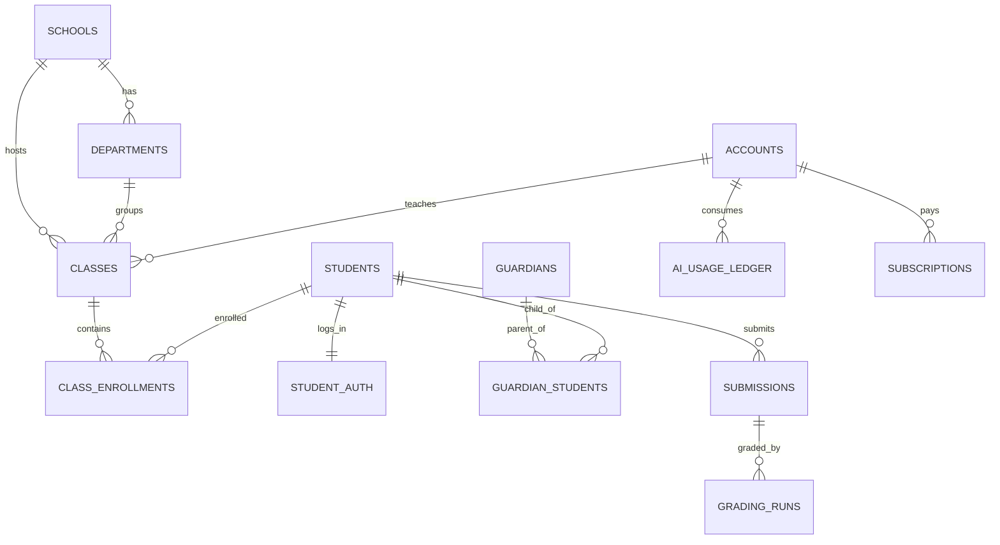
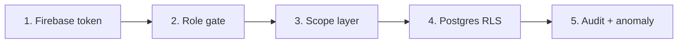
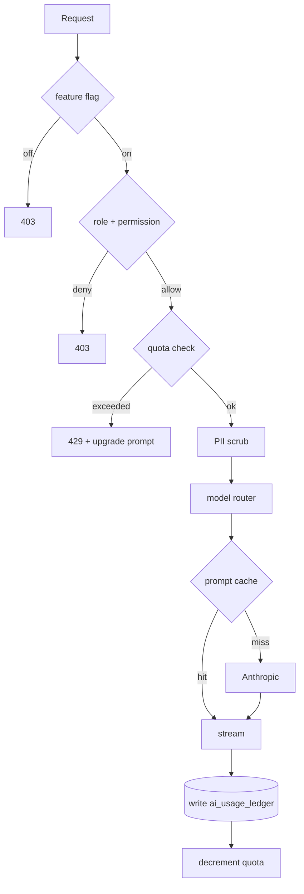
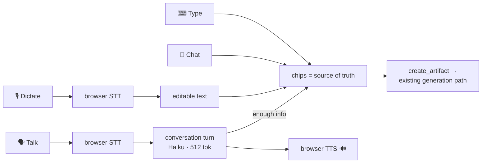
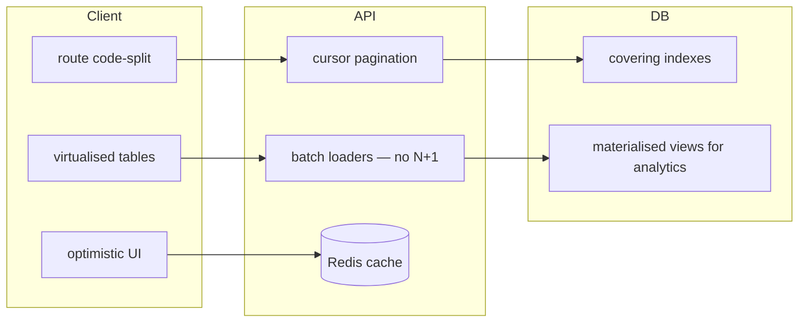
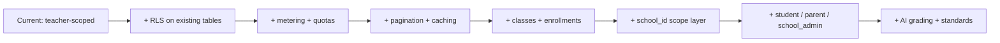

# 13 — Target Architecture

System design for Murchid at full scope. **Nothing existing is removed.** Every current table, route, view and feature appears here, either unchanged or extended.

Two rules govern every decision below:

| Rule | Meaning |
|---|---|
| **Security is structural** | Not a feature, not a phase. Every table gets RLS. Every route gets scope. Every role gets a deny-by-default boundary. |
| **Performance is designed in** | Bounded queries only. No unbounded list. No N+1. Nothing loaded that isn't shown. |

---

## 1 — System context



**Change from today:** three new infrastructure pieces — object storage (files leave Postgres), Redis (shared rate-limit + cache + queue), job queue (async AI work).

---

## 2 — Role model

Existing six roles stay exactly as they are. Four added.

| Role | Status | Tenant root | AI access |
|---|---|---|---|
| `dev` | exists | global | full + system |
| `super_admin` | exists | global | full |
| `owner` | exists | global | read-only analytics |
| `admin` | exists | global | ops analytics |
| `moe` | exists | emirate | aggregate analytics only |
| `teacher` | exists | own account | **full generation + grading + voice** |
| `student` | **new** | own record | **restricted — see §5** |
| `parent` | **new** | linked children | summaries only, no generation |
| `school_admin` | *deferred* | one school | — |
| `hod` | *deferred* | department | — |

> **Scope decision.** `school_admin`, `hod` and `departments` are **deferred to a future workspace product**, along with inspection packs, curriculum coverage reporting and school-wide billing. They sell to a school; the customer today is the teacher. Students and parents are what make the teacher's product complete, so those ship first. Nothing existing is removed — the current `admin` / `super_admin` / `owner` / `moe` / `dev` consoles stay as they are. See [`14-roadmap.md`](14-roadmap.md) → *Scope decision*.
>
> The practical consequence: **the tenant root stays `account_id`** (the teacher). The `school_id` scope layer described below is part of the workspace product, not the next 18 days — which also means Day 2's RLS model carries forward unchanged instead of being refactored.

### Tenant hierarchy



**Critical migration note.** Today the tenant root is `account_id` (a teacher). Adding school-level roles means the root becomes `school_id`, with teacher scope nested inside it. This is the single largest structural change and it must be additive: `account_id` scoping keeps working unchanged, `school_id` scoping is layered above it.

---

## 3 — Data model

### Existing tables — kept, unchanged in shape

`accounts` · `templates` · `drafts` · `students` · `schedule_entries` · `quizzes` · `quiz_questions` · `quiz_scores` · `homework` · `homework_submissions` · `attendance` · `student_grades` · `presentations` · `activities` · `activity_completions` · `notifications` · `library_resources` · `feature_flags` · `audit_log` · `email_verifications` · `schools` · `account_schools` · `uploaded_images`

### New tables

| Table | Purpose | Key columns |
|---|---|---|
| `classes` | the missing join between teacher, subject, grade, section | `id, school_id, teacher_id, subject, grade, section, academic_year` |
| `class_enrollments` | student ↔ class | `class_id, student_id, status` |
| `guardians` | parent identity | `id, firebase_uid, email, phone, preferred_lang` |
| `guardian_students` | parent ↔ child, with relationship | `guardian_id, student_id, relationship, is_primary` |
| `student_auth` | student login, separate from `accounts` | `student_id, firebase_uid, status, login_enabled` |
| `departments` | subject groupings per school | `id, school_id, name, hod_account_id` |
| `ai_usage_ledger` | **every** AI call, immutable | `id, account_id, role, endpoint, model, input_tokens, output_tokens, cache_read, cost_fils, created_at` |
| `ai_quotas` | per-account budget | `account_id, period, tokens_cap, tokens_used, hard_stop` |
| `subscriptions` | real billing state | `id, account_id, school_id, plan, status, provider, provider_ref, period_start, period_end` |
| `payments` | transaction log | `id, subscription_id, amount_fils, currency, status, provider_ref, raw_response` |
| `curriculum_standards` | MoE / NC / CC / IB outcomes | `id, framework, grade, subject, code, description_en, description_ar` |
| `artifact_standards` | artifact ↔ standard tagging | `artifact_type, artifact_id, standard_id, confidence` |
| `submissions` | student work, one row per attempt | `id, student_id, artifact_type, artifact_id, content, submitted_at, status` |
| `grading_runs` | AI grading job + human override | `id, submission_id, model, ai_score, ai_feedback, teacher_score, teacher_feedback, status` |
| `files` | object-storage pointer, replaces base64 | `id, account_id, school_id, bucket, key, mime, bytes, checksum` |
| `parent_messages` | teacher ↔ parent comms | `id, student_id, teacher_id, guardian_id, body_en, body_ar, sent_at, read_at` |
| `generations` | Studio history, restorable | `id, account_id, kind, prompt, params, output, tokens, created_at` |
| `prompt_presets` | saved school/teacher styles | `id, scope, owner_id, kind, name, system_addendum` |

### Entity relationships — new core



---

## 4 — Security architecture

Defense in depth. Five independent layers; any one failing does not expose data.



| Layer | Mechanism | Fails how |
|---|---|---|
| 1 — Identity | Firebase `verifyIdToken`, session binding | Bad token → 401 |
| 2 — Role | `requireRole()` at mount, deny-by-default | Wrong role → 403 |
| 3 — Scope | `crudRouter` + new `schoolScoped` / `studentScoped` / `guardianScoped` | Foreign id → 404, never 403 (no existence leak) |
| 4 — **RLS** | Postgres row-level security on every tenant table, session var `app.current_account` | Even a hand-written route with a missed WHERE returns zero rows |
| 5 — Audit | `audit_log` + anomaly rules on read volume | Detects what the first four missed |

### Layer 4 is new and non-negotiable

Today `crud.js` **is** the entire tenant boundary — one forgotten `WHERE` leaks another teacher's roster. With students and parents in the system that becomes a minors-data breach under UAE PDPL. RLS makes the database refuse, independent of application code.

```sql
ALTER TABLE students ENABLE ROW LEVEL SECURITY;
CREATE POLICY students_tenant ON students
  USING (account_id = current_setting('app.current_account')::int
      OR school_id  = ANY(string_to_array(current_setting('app.current_schools'), ',')::int[]));
```

### Minors' data — hard rules

| Rule | Implementation |
|---|---|
| Student PII never leaves the school boundary | RLS + `school_id` scope on every student-touching query |
| Parent sees only their own children | `guardian_students` join, enforced in RLS, never a query param |
| Student cannot see another student | RLS policy `student_id = current_setting('app.current_student')` |
| No student data in AI prompts without pseudonymisation | AI gateway strips names → `Student A/B/C` before send |
| Right to erasure (PDPL Art. 15) | Cascade delete + `files` purge + audit tombstone |

### Other hardening

| Item | Now | Target |
|---|---|---|
| Rate limit key | IP only | account_id + IP, Redis-backed, per-route class |
| AI route limit | none | separate tight bucket + quota check |
| Permission matrix | 24 keys, **unenforced** | enforced in middleware, single `can()` helper |
| Secrets | `.env` | secret manager in prod, rotation runbook |
| Input validation | zod on ~8 routes | zod on **every** body, param and query |
| File upload | base64 → Postgres, 2 MB cap collision | object storage, signed URL, MIME sniff, AV scan |
| Session | single-device forced logout | device list, max N, explicit revoke |
| Error output | good (`handleErr`) | keep, extend to AI + payment paths |

---

## 5 — AI architecture

### Gateway — all AI traffic through one path



**Every** call writes to `ai_usage_ledger` before the response completes. No exceptions — this is what makes cost knowable.

### Model routing

| Task | Model | max_tokens | Why |
|---|---|---|---|
| Quiz question gen, short rewrite, tweak | Haiku 4.5 | 4096 | cheap, structured, high volume |
| Lesson plan, presentation, differentiation | Sonnet | 8192 | quality visible to teacher |
| **Grading** (vision + judgement) | Sonnet | 4096 | accuracy is the product |
| **Voice conversation turn** | Haiku 4.5 | 512 | many short turns; the cap is what keeps it affordable |
| Report comments, parent messages | Haiku 4.5 | 2048 | templated, high volume |
| Student hints (Socratic) | Haiku 4.5 | 512 | tight cap prevents answer leakage |
| Analytics summaries | Haiku 4.5 | 1024 | internal |

### Four ways in, one generation path

The teacher chooses how to work; the product does not choose for them. Every mode converges on the same `create_artifact` call, so there is exactly one generation stack.

| Mode | Input | Output | Turns |
|---|---|---|---|
| **Type** | keyboard | artifact | one shot |
| **Chat** | keyboard | revised artifact | many, threaded |
| **Dictate** | 🎙 → editable text | artifact | one shot |
| **Talk** | 🎙 conversation | artifact | many, spoken |



**Talk is its own surface**, reachable from anywhere in the app rather than only from inside Studio — a teacher walking between classes shouldn't have to navigate to Studio to start talking. Chat and Dictate live on the Studio screen where the work already is.

Speech recognition and synthesis both run **in the browser** (Web Speech API), not through a paid service: no per-minute cost, Arabic voices available, and audio never leaves the device. Only the resulting *text* reaches the server, which also keeps the privacy story simple — there is no voice recording to store, retain or explain.

Three rules this design depends on:

- **The transcript is always editable before it costs anything.** Speech recognition mishears, especially in a noisy classroom or across an accent. Text lands in the prompt box; the teacher can fix it; nothing bills until they act.
- **The conversation fills the chips, visibly.** Whatever is agreed out loud shows up in the normal settings chips, so the teacher can see what Murchid heard before generating. The chips remain the source of truth.
- **Generation reuses the existing path.** The conversation ends in a forced `create_artifact` tool call that hands to the same endpoint the typed flow uses. One generation stack, not two.

**Cost is the real risk.** A spoken exchange is several short calls where typing was one, and the budget is already tight at three artifacts a day. Voice runs on the cheap model at a hard 512-token cap, counts against the same per-account quota as everything else, and is measured on the ledger from the first day it ships.

### AI per role — the cheating boundary

| Role | Allowed | **Blocked** |
|---|---|---|
| Teacher | generate all artifacts, AI grading, differentiation, report comments, parent messages, standards tagging, analytics | — |
| HoD | dept analytics, moderation summaries, standards coverage | student-level generation |
| School admin | school analytics, comms drafting, inspection pack assembly | teaching content generation |
| **Student** | Socratic hints (never the answer), explanation **after** submit, adaptive practice, vocabulary/translation support, study-plan suggestion | **free-form generation, essay writing, homework answers, any raw model access** |
| Parent | plain-language summary of child progress, EN⇄AR translation of teacher messages | anything generative about schoolwork |
| MoE | aggregate trends only, never per-student | per-student anything |

**Student guardrails — enforced, not prompt-only:**

1. Separate system prompt, `max_tokens: 512`, tool-free.
2. Server-side refusal classifier before send — blocks "write my essay" class prompts.
3. Hints only unlock **after** an attempt is recorded in `submissions`.
4. Every student AI call logged to `ai_usage_ledger` and **visible to their teacher**.
5. Rate-limited far tighter than teacher; per-day cap.

### AI features by surface

| Surface | Feature | Priority |
|---|---|---|
| Grading | **camera capture** → AI marks → teacher reviews | **P0 — the 10x** |
| Studio | generation (exists) + history, presets, versions | P0 |
| Studio | **Chat** — typed threaded refinement | P0 |
| Studio | **Dictate** — mic → editable text → generate | P0 |
| Anywhere | **Talk** — dedicated spoken assistant, its own surface | P0 |
| Reports | auto report-card comments, evidence-backed, EN/AR | P0 |
| Lesson plans | differentiation (support/core/stretch) one click | P0 |
| Parent portal | progress summary, translated messages | P1 |
| Student portal | Socratic tutor, adaptive practice | P1 |
| Gradebook | trend detection, at-risk flags | P1 |
| Attendance | anomaly detection, pattern alerts | P2 |
| All artifacts | curriculum-standard auto-tagging | *deferred → workspace* |
| Inspection | one-click KHDA/ADEK evidence pack | *deferred → workspace* |
| School admin | cohort insights, teacher workload | *deferred → workspace* |

---

## 6 — Performance architecture

### Confirmed problems in current code

| # | Problem | Evidence | Impact at scale |
|---|---|---|---|
| 1 | **No pagination anywhere** | zero `LIMIT`/`OFFSET` in `backend/lib/crud.js` | a 2,000-student roster ships 2,000 rows every load; a school kills it |
| 2 | **No code splitting** | `Studio.jsx` 5,199 lines, `Landing.jsx` 7,266 lines, single bundle | slow first paint on school wifi / older iPads |
| 3 | **Files in Postgres** | `uploaded_images.data` base64 TEXT | DB bloat, slow backups, expensive Neon storage |
| 4 | **Rate limit in-process** | `express-rate-limit` memory store | resets on deploy, wrong across instances |
| 5 | **Flag read per request** | `studio.js` selects `feature_flags` on every generation | extra round trip per call |
| 6 | **No caching layer** | none | every dashboard hit recomputes |
| 7 | Dashboard aggregates | `/api/dashboard` multi-query bundle | fine now, needs indexes + cache at scale |

### Targets

| Metric | Target |
|---|---|
| API p95 | < 200 ms |
| First contentful paint (3G, iPad) | < 2.0 s |
| Route transition | < 100 ms |
| AI first token | < 1.5 s |
| List endpoint payload | ≤ 50 rows/page, always |
| Bundle initial | < 250 KB gzip |

### Mechanisms



| Layer | Action |
|---|---|
| DB | keep existing 34 indexes; add covering indexes for every new list path; materialised views for school/MoE analytics, refreshed on schedule |
| API | cursor pagination in `crudRouter` (one change, all 11 resources inherit); Redis cache for flags, dashboards, catalogs; batch loaders on submissions/scores |
| Files | object storage + signed URLs + CDN; `uploaded_images` migrated, table retained for rollback |
| Client | route-level `React.lazy`; split `Studio` and `Landing`; virtualised roster/gradebook tables; skeletons everywhere |
| AI | prompt caching (exists — keep), stream always, async queue for grading batches |
| Resilience | **error boundaries** per shell; offline PWA cache for read paths; retry with backoff |

### "Butter in the worst case"

| Worst case | Design answer |
|---|---|
| School of 80 teachers behind one NAT | rate limit keyed on account, not IP |
| Teacher with 2,000 students | cursor pagination + virtualised table |
| Exam week — 500 concurrent submissions | job queue, async grading, backpressure |
| Neon cold start / Render sleep | paid tier + health ping + skeleton UI, never a blank screen |
| Anthropic slow or down | stream timeout, graceful degrade, queue + retry, cached last-good |
| iPad on weak school wifi | small bundle, PWA cache, offline read, optimistic write |
| One component throws | error boundary contains it — page survives |

---

## 7 — Migration path

Additive only. Nothing existing breaks at any step.



| Step | Existing behaviour |
|---|---|
| S1 RLS | unchanged — policies mirror current `account_id` scope exactly |
| S2 metering | unchanged — ledger writes are additive |
| S3 pagination | list endpoints gain `?cursor=&limit=`, default preserves current behaviour for small sets |
| S4 classes | `students.grade/section` retained; `classes` derived alongside |
| S5 school scope | `account_id` scope still applies; `school_id` layered above |
| S6 new roles | new nav maps, new routers; teacher surface untouched |
| S7 AI features | new endpoints; existing four Studio endpoints unchanged |

---

## 8 — Code standards

Non-negotiable for every file touched.

| Area | Standard |
|---|---|
| Routes | extend `crudRouter`; hand-written routers require a scope test |
| Validation | zod schema on every body/param/query, `.strip()` unknown keys |
| Errors | `handleErr` only; never leak PG messages; correlation id always |
| Queries | parameterised only; no string concat; `EXPLAIN` any new list path |
| Tenancy | RLS policy required before a table ships |
| Frontend | `api()` helper only; no bare `fetch` on `/api/*` |
| Enums | `src/lib/enums.js` only |
| Components | error boundary at every route shell |
| Comments | explain *why* — match `backend/app.js` density |
| Tests | scope test + happy path per new router; snapshot per AI schema |
| Perf | no unbounded list; no N+1; no query inside a loop |

---

## 9 — What this does not remove

Explicit: every existing feature survives. Items previously flagged as unnecessary are **completed, not deleted**.

| Item | Disposition |
|---|---|
| Permission matrix (24 keys, unenforced) | **enforced** via `can()` — becomes real |
| MoE console | **kept**, gains real analytics + materialised views |
| Owner / admin / super-admin consoles | **kept**, gain metering + revenue data |
| Sub-roles (accountant, inspector…) | **kept**, wired to the permission matrix |
| Email OTP | **kept**, skipped when provider asserts `email_verified` |
| Single-device lockout | **replaced** by device list + explicit revoke (same intent, no lockout) |
| `Library.jsx`, `DatabaseGrades`, `DatabaseAttendance` | **wired up** — see roadmap Phase 1 |
| Bulletin board | **built** — becomes class announcements |
| Activity kind in Studio | **exposed** — plumbing already complete |
