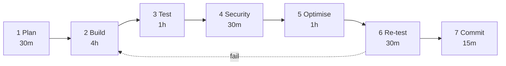

# 14 — Build Roadmap

Execution plan for [13 — Target Architecture](13-architecture.md). One builder + Claude Code.

## Timeline

| | |
|---|---|
| **Day 13** | **Shippable, sellable product** — teacher app solid, AI proven (incl. grading + voice), payments live. Stop here and you have a business. |
| **Day 18** | Production ready with **students and parents** in the product. |
| **Days 19–20** | Buffer. Not planned work. |

14 days does not hold all of this. Day 13 is the honest commercial milestone.

## Scope decision — what we are NOT building yet

**No school-management layer.** No `school_admin` role, no head-of-department, no departments, no inspection evidence packs, no MoE analytics, no new privileged consoles. That whole layer is deferred to a future **workspace** product.

Why: those features sell to a *school*, and we don't have one yet. Students and parents make the product complete for the teacher who is already using it, which is what "production ready" means here.

**Nothing is deleted.** The existing `admin` / `super_admin` / `owner` / `moe` / `dev` consoles stay exactly as they are — they're built and they work. We are simply not extending that layer.

**Classes stay in scope**, because a student has to belong to something and a parent has to be linked through something. Class is the minimum structure students and parents need — it is not school management.

---

## Daily workflow — every day, no exceptions

| Step | Gate — cannot pass without |
|---|---|
| 1 Plan | files listed, done-criteria written |
| 2 Build | follows §8 code standards |
| 3 Test | runs in browser, no console errors |
| 4 **Security** | scope test passes, RLS verified, zod on every input |
| 5 Optimise | no unbounded query, no N+1, `EXPLAIN` clean |
| 6 Re-test | still green after optimisation |
| 7 Commit | one logical unit, pushed to `dev` |

**Day is not done until steps 4 and 5 pass.** These are the two that get skipped under pressure; they are the two that cause rebuilds.

---

## Phase map

```mermaid
gantt
    dateFormat X
    axisFormat Day %s
    section Foundation
    Security + perf base      :0, 3
    section Teacher
    Fix + wire + polish       :3, 3
    section AI
    Gateway + grading + voice :6, 4
    section Money
    Payments + lifecycle      :10, 3
    section People
    Classes/Students/Parents  :13, 4
    section Ship
    Harden + launch           :17, 1
```

---

# PHASE 0 — Foundation · Days 1–3

Nothing else is safe until this exists.

### Day 1 — Stop the bleeding

| | |
|---|---|
| **Goal** | App survives errors; dev is usable; cost is visible |
| **Files** | `src/components/ErrorBoundary.jsx` (new), `src/App.jsx`, `src/views/Landing.jsx`, `backend/lib/security.js`, `backend/db/init.js`, `backend/routes/studio.js` |

1. **Error boundary** — new component; wrap landing sections, studio shell, every route shell. Fallback = branded retry card, never a white screen. *Fixes F22 class permanently.*
2. **Rate limiter** — make the `TEMP-DEV-REVIEW` `/api/*` scope permanent; key on `account_id` when authenticated, IP when not; separate tight bucket for `/api/studio/*`. *Fixes F14, F7.*
3. **`ai_usage_ledger` table** — create; write from all four studio endpoints. Usage is already computed and discarded — persist it. *Fixes F6.*

**Done when:** a thrown component shows the fallback, not a blank page · 20 page loads don't 429 · one generation writes one ledger row.

### Day 2 — RLS + scope hardening

| | |
|---|---|
| **Goal** | Database refuses cross-tenant reads even if app code forgets |
| **Files** | `backend/db/init.js`, `backend/lib/db.js`, `backend/lib/auth.js`, `backend/lib/crud.js` |

1. Session vars — set `app.current_account` / `app.current_schools` per connection checkout.
2. RLS policies on all 11 tenant tables, mirroring current `account_id` scope exactly.
3. Scope test suite — for each resource, assert teacher B gets 404 on teacher A's row.
4. zod on every remaining route body/param/query.

**Done when:** every scope test passes · a deliberately unscoped hand-written query returns zero rows · no behaviour change for a normal teacher.

### Day 3 — Performance foundation

| | |
|---|---|
| **Goal** | Nothing unbounded ever ships |
| **Files** | `backend/lib/crud.js`, `src/views/_data-view.jsx`, `vite.config.js`, `src/App.jsx` |

1. **Cursor pagination in `crudRouter`** — one change, all 11 resources inherit. `?cursor=&limit=` , default 50, hard max 200. *Fixes the #1 scale bug.*
2. **Code splitting** — `React.lazy` per route; split `Studio.jsx` (5,199 lines) and `Landing.jsx` (7,266 lines) out of the initial bundle.
3. Redis — cache `feature_flags` (kills a per-request query), move rate-limit store off memory.
4. Skeletons on every list.

**Done when:** roster of 2,000 seeded students loads in one page · initial bundle < 250 KB gzip · flag lookup no longer hits Postgres per generation.

---

# PHASE 1 — Teacher app solid · Days 4–6

### Day 4 — Wire the orphans

| | |
|---|---|
| **Goal** | Every built feature is reachable |
| **Files** | `src/App.jsx`, `src/views/Database.jsx`, `src/lib/i18n.jsx` |

1. **Attendance + Gradebook** — register in `NAV_BY_ROLE` + `SECTIONS_BY_ROLE`, add tabs to `Database.jsx`. *Fixes F30 — the biggest gap.*
2. Verify both views actually work once reachable (they have never been exercised).
3. **Reports + Schedule** into the sidebar. *Fixes F31.*
4. **Library** wired. *Fixes F33.*
5. **Bulletin board** → class announcements, or removed from nav. *Fixes F32.*
6. Expose Studio's `activity` kind — plumbing already complete.

**Done when:** a teacher can record attendance, enter a grade, and see it appear in Reports · no nav item is a dead end.

### Day 5 — Fix the funnel

| | |
|---|---|
| **Goal** | Nothing fails silently; nothing is legally exposed |
| **Files** | `src/views/Landing.jsx`, `src/lib/firebaseAuth.js`, `src/lib/i18n.jsx`, `backend/lib/auth.js` |

1. **Consent checkbox unticked by default**, submit disabled until ticked. *Fixes F16 — PDPL exposure, one line.*
2. **Translate consent text** to Arabic. *Fixes F17.*
3. **Fix Outlook copy** — add the Microsoft button or remove the claim, EN + AR. *Fixes F15.*
4. **Map provider errors** to human sentences; handle `popup-blocked` with redirect fallback. *Fixes F18, F23.*
5. **Routable auth** — `/signin`, `/signup`; deep-link returns after login. *Fixes F19, F20.*
6. **Device list replaces single-device lockout.** *Fixes F10, F26.*

**Done when:** popup blocked → clear message + redirect works · `/planner` signed-out → "sign in to continue" → returns to `/planner` · consent unticked.

### Day 6 — Polish + i18n sweep

| | |
|---|---|
| **Goal** | Product feels finished in both languages |
| **Files** | `src/views/Studio.jsx`, 22 untranslated views, `src/lib/i18n.jsx` |

1. **Auto-select single-option chips** in Studio. *Fixes F27 — removes 60% of interaction.*
2. Disabled `Make it` shows reason on click. *Fixes F25 remnant.*
3. Translate the 22 hardcoded-English views (My students area + all consoles). *Fixes F34.*
4. My-students grade filter shows only taught grades. *Fixes F35.*
5. Pluralisation fixes. *Fixes F29.*
6. `class_map` populated at onboarding. *Fixes F28.*

**Done when:** full Arabic pass with zero English leakage · Studio needs ≤ 2 clicks when only one option exists.

---

# PHASE 2 — AI proven · Days 7–10

### Day 7 — AI gateway

| | |
|---|---|
| **Goal** | All AI traffic through one metered, quota'd, cached path |
| **Files** | `backend/lib/aiGateway.js` (new), `backend/routes/studio.js`, `backend/db/init.js` |

1. `ANTHROPIC_API_KEY` wired; `ai_studio` flag on.
2. **AI gateway** — flag → permission → quota → PII scrub → model router → ledger. All four existing endpoints refactored through it.
3. **Model routing** per §5 table.
4. **`ai_quotas`** — per-account cap, 429 + upgrade prompt on exceed.
5. **PII scrubber** — student names → `Student A/B/C` before send.

**Done when:** every generation writes a ledger row with real cost · exceeding quota returns 429, not a bill · no student name reaches Anthropic.

### Day 8 — AI grading by camera (the 10x)

| | |
|---|---|
| **Goal** | The feature that makes teachers tell other teachers |
| **Files** | `backend/routes/grading.js` (new), `src/views/Grading.jsx` (new), `backend/db/init.js` |

1. `submissions` + `grading_runs` tables.
2. **Camera capture in the browser** — `getUserMedia` for a live shot on a phone or iPad, plus file upload as the fallback. Multi-page capture for a stack of papers; client-side downscale before upload (a 12MP photo is wasted tokens).
3. Images to object storage, never base64 in Postgres.
4. Vision grading against the quiz's existing typed answer key in `quiz_questions`.
5. **Teacher review screen** — AI score + confidence per question, one-click accept or override. AI is never final.
6. Low-confidence and unreadable items flagged for mandatory review.
7. Batch grading through the job queue so a 30-paper stack doesn't hold a request open.

**Done when:** a teacher photographs 20 sheets on a phone, the run completes in the background, they accept or override, and scores land in `quiz_scores`.

### Day 9 — Four ways in: type, chat, dictate, talk

| | |
|---|---|
| **Goal** | The teacher picks how they want to work — the product doesn't pick for them |
| **Files** | `src/views/Studio.jsx`, `src/views/TalkAssistant.jsx` (new), `src/lib/speech.js` (new), `backend/routes/studio.js`, `backend/lib/aiGateway.js` |

**One Studio, four entry modes, one generation path.** Every mode ends at the same `create_artifact` call, so there is never a second generation stack to keep in sync.

| Mode | How it works | When a teacher reaches for it |
|---|---|---|
| **Type** | What exists today — prompt box + chips | Precise wording, quiet room |
| **Chat** | Typed back-and-forth in a thread. "Make it easier", "add a starter", "shorten question 3" | Refining something that's already drafted |
| **Dictate** | Mic button fills the prompt box with editable text, then generate as normal | Hands full, or faster than typing — especially in Arabic |
| **Talk** | Live spoken conversation. Murchid asks what it needs and speaks back | Thinking out loud, walking between classes |

**1 · Type** — unchanged. It stays the default and is never removed.

**2 · Chat.** A thread on the result, not a new surface. Each turn carries the current artifact as context and returns a revision. This is what makes Studio feel like an AI product rather than a form.

**3 · Dictate.** Web Speech API (`SpeechRecognition`) — browser-native, no per-minute cost, supports `ar-SA` / `ar-AE`. Falls back to typing where unsupported. **The transcript lands as editable text and does not auto-submit.** Recognition mishears, especially across an accent or in a noisy staff room; a misheard word must never silently become a wrong quiz.

**4 · Talk — the dedicated voice assistant.** Its own surface, reachable from anywhere in the app (persistent affordance in the shell, not buried inside Studio) — a teacher walking to class shouldn't have to navigate to Studio first.
- Speech in via the same recogniser; speech out via `SpeechSynthesis` (free, built in, Arabic voices available).
- Runs through the **AI gateway** like everything else, with a short-turn system prompt.
- Murchid asks only what it actually needs — grade, length, question count — and stops asking once it can build.
- Ends in a forced `create_artifact(kind, params, prompt)` tool call that hands to the existing generation path.
- **The chips stay authoritative.** Whatever the conversation settles fills the chips visibly, so the teacher can see and correct what Murchid heard before anything generates.
- **Live transcript beside the audio**, always. Accessibility, plus you can't always listen in a staff room — and it's how a teacher catches a misheard "Grade 9" for "Grade 5".
- Interruptible: talking over Murchid stops it, the way a real conversation works.

**Cost note — Talk is the expensive one.** A multi-turn spoken exchange costs several times a single generation, and we already exceed the $1.40/user/month budget at three artifacts a day. It runs on the cheap model at a hard `max_tokens`, counts against the same per-account quota, and is measured on the ledger from day one. Review a week of real numbers before making it the default entry point.

**Done when:** the same quiz can be produced four ways — typed, refined in chat, dictated, and talked through — every one lands in the same place, and the ledger shows what each mode cost.

### Day 10 — AI teaching features

| | |
|---|---|
| **Goal** | Studio behaves like a real LLM product |
| **Files** | `backend/routes/studio.js`, `src/views/Studio.jsx`, `src/views/Reports.jsx` |

1. **Generation history** — `generations` table, searchable, restorable. Nothing lost again, and it stores which mode produced it (type / chat / dictate / talk) so we can see what teachers actually use.
2. **Prompt presets** — save a school's lesson format once, reuse. Works from every mode.
3. **Differentiation** — one click → support/core/stretch.
4. **Report comments** — evidence-backed from grades + attendance + homework, EN/AR.
5. **Usage dashboard** — tokens, AED spend, quota remaining, per teacher, **broken down by mode** so the cost of Talk is visible next to the cost of typing.

*(Chat follow-up ships on Day 9 as one of the four entry modes.)*

**Done when:** a teacher generates, saves a preset, and sees exactly what it cost — and which mode cost the most.

---

# PHASE 3 — Money · Days 11–13

### Day 11 — Payment integration

| | |
|---|---|
| **Goal** | Money can actually arrive |
| **Files** | `backend/routes/billing.js` (new), `backend/db/init.js`, `src/views/Landing.jsx` |

1. Gateway: **Telr or PayTabs** (better AED approval rates in MENA than Stripe). Stripe as fallback.
2. `subscriptions` + `payments` tables.
3. Checkout for the three existing plans (29.99 / 26.99 / 22.49 AED).
4. **Webhook handler** — signature-verified, idempotent, replay-safe.
5. Replace the `/api/auth/renew` placeholder. *Fixes F5.*

**Done when:** test card completes → webhook writes payment → subscription active → gated features unlock.

### Day 12 — Subscription lifecycle

| | |
|---|---|
| **Goal** | Trials convert, failures recover, nobody is wrongly locked out |
| **Files** | `backend/routes/billing.js`, `backend/lib/auth.js`, `backend/routes/admin.js` |

1. Trial → paid conversion, 7-day trial already exists.
2. Dunning — retry, grace period, email sequence.
3. Cancel / reactivate / plan change with proration.
4. **Quota tied to plan** — AI budget per tier, enforced by the gateway.
5. Revenue data into owner/admin/super-admin dashboards (real numbers, not computed guesses).

**Done when:** trial expiry → paywall → payment → instant unlock · failed renewal → grace, not lockout.

### Day 13 — 🚩 SHIPPABLE MILESTONE

| | |
|---|---|
| **Goal** | Production-ready. Could take real teachers tomorrow. |

1. Render off free tier. *Fixes F4.*
2. `sslmode=verify-full`. *Fixes F3.*
3. Sentry + structured logs + uptime alerts.
4. Load test: 100 concurrent teachers, 50 concurrent generations.
5. Full security pass — OWASP checklist, dependency audit, secret rotation.
6. Backup + restore drill on Neon.
7. Docs 04/07/09 corrected. *Fixes F12, F13.*

**Done when:** load test green at p95 < 200 ms · no critical/high vulnerabilities · restore drill succeeds.

> **Stop here and you have a sellable product** — one a teacher pays for and uses every day. Everything below makes it complete rather than merely sellable: students actually using it, and parents seeing the result.

---

# PHASE 4 — Students & parents · Days 14–17

No school-management layer here — see the scope decision at the top. Classes exist because students belong to them and parents are linked through them, not as an org chart.

### Day 14 — Classes

| | |
|---|---|
| **Goal** | The structure students and parents attach to |
| **Files** | `backend/db/init.js`, `backend/routes/classes.js` (new), `src/views/Classes.jsx` (new) |

1. `classes` (`teacher_id`, subject, grade, section, academic year) and `class_enrollments`.
2. RLS policies on both, same pattern as every other tenant table.
3. Backfill from the existing `grade_sections` / `class_map` so nobody re-enters what they typed in onboarding.
4. Teacher UI: create a class, add students to it from the existing roster.

**Deliberately NOT here:** no `departments`, no `school_id` scope layer, no school-level roles. The tenant root stays `account_id` — the teacher. That keeps Day 2's RLS model intact and avoids a refactor we don't yet need.

**Done when:** existing teacher behaviour is byte-identical · a class lists its students · the day-2 scope tests still pass unchanged.

### Day 15 — Student portal

| | |
|---|---|
| **Goal** | Students use it without being able to cheat |
| **Files** | `backend/routes/student.js` (new), `src/views/student/*` (new), `backend/lib/aiGateway.js` |

1. `student_auth`, student login, teacher-controlled enable.
2. Student views — my work, submit, my results, my schedule.
3. **Restricted AI** per §5: Socratic hints only, `max_tokens: 512`, hints locked until an attempt is recorded, refusal classifier, every call visible to the teacher.
4. Submission flow → feeds Day 8 grading.
5. RLS: a student can read exactly their own rows.

**Done when:** "write my essay" is refused · hints unavailable before an attempt · student A cannot see student B by any request · teacher sees the student's AI log.

### Day 16 — Parent portal

| | |
|---|---|
| **Goal** | The retention and word-of-mouth surface |
| **Files** | `backend/routes/parent.js` (new), `src/views/parent/*` (new) |

1. `guardians`, `guardian_students`, invite + verify flow.
2. Parent views — child progress, attendance, homework, upcoming.
3. **AI progress summary** in plain language, EN/AR.
4. Teacher ⇄ parent messaging with auto-translation.
5. RLS: strictly own children, never a query param.

**Done when:** a parent sees only their children · summary reads naturally in both languages · a guardian id in the URL changes nothing.

### Day 17 — Close the loop: students, parents, grading, voice together

| | |
|---|---|
| **Goal** | The three new surfaces behave as one product, not three features |
| **Files** | `src/views/student/*`, `src/views/parent/*`, `backend/routes/grading.js`, `src/views/Classes.jsx` |

1. **Assign to a class**, not just a grade+section — quizzes, homework and activities target a class, and its enrolled students see them.
2. **Student submits → teacher grades → parent sees the result.** The full path, end to end, including a photographed paper submission running through Day 8's grading.
3. **Class-level views** for the teacher: who has submitted, who hasn't, class average.
4. Notifications wired across the three roles (homework assigned → student; result published → parent).
5. Arabic pass over every new student and parent screen — parents are the most likely of all our users to want Arabic.

**Done when:** one homework, assigned to a class, is seen by a student, submitted, graded from a photo, and visible to that student's parent — in both languages, with no cross-tenant leak at any hop.

> **Curriculum-standards tagging moved out.** It is genuinely the strongest long-term moat, but its value shows up in coverage reporting — which is the school-management surface we just deferred. It moves to the workspace product with the rest of that layer.

---

# PHASE 5 — Ship · Day 18

| | |
|---|---|
| **Goal** | Full scope, production-hard |

1. End-to-end regression across teacher, student and parent.
2. Load test — exam-week simulation, 500 concurrent submissions.
3. Penetration pass — cross-tenant, cross-role, IDOR, minors-data paths.
4. **PDPL review** — consent, erasure, retention, and minors handling. This is the one that gates launch: students are children, and a parent's data is tied to them.
5. **Voice privacy check** — confirm nothing from the microphone is retained beyond the request, and that the transcript is treated as prompt content (never written to the usage ledger).
6. Mobile/tablet pass — iPad is the real device, and it is also the camera for grading.
7. PWA offline for read paths.
8. Runbooks: incident, rollback, restore, key rotation.

**Done when:** no cross-tenant leak under active attempt · exam-week load holds p95 · a teacher can photograph, grade and publish from an iPad on throttled wifi.

---

## Risk register

| Risk | Mitigation |
|---|---|
| Class/enrollment work breaks the teacher app | additive only, tenant root stays `account_id`; day-2 scope tests run every day after |
| AI grading accuracy below trust threshold | teacher review mandatory; confidence flags; never auto-final |
| **Voice blows the AI budget** | cheap model, tight `max_tokens`, same per-account quota, measured on the ledger from day one — review after a week before making it the default entry point |
| Speech recognition weak in Arabic or a noisy classroom | transcript is always editable before it triggers a paid call; typing is never removed |
| Payment gateway approval delays | start merchant application **Day 1**, not Day 11 |
| AI cost overrun | quotas live Day 7, before any real usage |
| 18 days slips | Day 13 is a complete, sellable stop point |
| Minors-data exposure | RLS shipped Day 2, before any student row exists |

## Dependencies to start now

| Item | Needed by | Lead time |
|---|---|---|
| Payment merchant account | Day 11 | **1–2 weeks — start Day 1** |
| `ANTHROPIC_API_KEY` | Day 7 | immediate |
| Object storage bucket | Day 3 | immediate (also holds graded paper photos) |
| Redis instance | Day 3 | immediate |
| Render paid tier | Day 13 | immediate |
| HTTPS on the dev origin | Day 9 | immediate — `getUserMedia` and the speech APIs refuse to run on plain HTTP outside `localhost` |

## Deferred to the workspace product

Not cut — sequenced. These sell to a *school*, and the school is not the customer yet.

| Deferred | Why |
|---|---|
| `school_admin` and `hod` roles, departments | Org structure with no org to serve |
| Inspection evidence packs (KHDA / ADEK) | Bought by a principal, not a teacher |
| Curriculum-standards tagging + coverage reporting | Strongest long-term moat, but its payoff is coverage reporting — a school-admin surface |
| School-wide seat billing | Needs a school account first |
| MoE analytics with real data | Needs many schools before the aggregate means anything |
