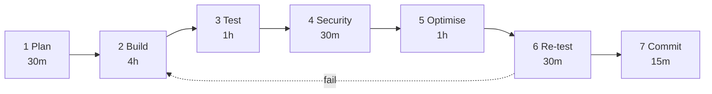

# 14 — Build Roadmap

Execution plan for [13 — Target Architecture](13-architecture.md). One builder + Claude Code.

## Timeline

| | |
|---|---|
| **Day 12** | **Shippable, sellable product** — teacher app solid, AI proven, payments live. Stop here and you have a business. |
| **Day 18** | Full scope — student, parent, school-admin portals live. |
| **Days 19–20** | Buffer. Not planned work. |

14 days does not hold all four goals. Day 12 is the honest commercial milestone; roles need 6 more.

---

## Daily workflow — every day, no exceptions

| Step | Gate — cannot pass without |
|---|---|
| 1 Plan | files listed, done-criteria written |
| 2 Build | follows §8 code standards |
| 3 Test | runs in browser, no console errors |
| 4 **Security** | scope test passes, RLS verified, zod on every input |
| 5 Optimise | no unbounded query, no N+1, `EXPLAIN` clean |
| 6 Re-test | still green after optimisation |
| 7 Commit | one logical unit, pushed to `dev` |

**Day is not done until steps 4 and 5 pass.** These are the two that get skipped under pressure; they are the two that cause rebuilds.

---

## Phase map

```mermaid
gantt
    dateFormat X
    axisFormat Day %s
    section Foundation
    Security + perf base     :0, 3
    section Teacher
    Fix + wire + polish      :3, 3
    section AI
    Studio + grading         :6, 3
    section Money
    Payments + metering      :9, 3
    section Roles
    Student/Parent/Admin     :12, 5
    section Ship
    Harden + launch          :17, 1
```

---

# PHASE 0 — Foundation · Days 1–3

Nothing else is safe until this exists.

### Day 1 — Stop the bleeding

| | |
|---|---|
| **Goal** | App survives errors; dev is usable; cost is visible |
| **Files** | `src/components/ErrorBoundary.jsx` (new), `src/App.jsx`, `src/views/Landing.jsx`, `backend/lib/security.js`, `backend/db/init.js`, `backend/routes/studio.js` |

1. **Error boundary** — new component; wrap landing sections, studio shell, every route shell. Fallback = branded retry card, never a white screen. *Fixes F22 class permanently.*
2. **Rate limiter** — make the `TEMP-DEV-REVIEW` `/api/*` scope permanent; key on `account_id` when authenticated, IP when not; separate tight bucket for `/api/studio/*`. *Fixes F14, F7.*
3. **`ai_usage_ledger` table** — create; write from all four studio endpoints. Usage is already computed and discarded — persist it. *Fixes F6.*

**Done when:** a thrown component shows the fallback, not a blank page · 20 page loads don't 429 · one generation writes one ledger row.

### Day 2 — RLS + scope hardening

| | |
|---|---|
| **Goal** | Database refuses cross-tenant reads even if app code forgets |
| **Files** | `backend/db/init.js`, `backend/lib/db.js`, `backend/lib/auth.js`, `backend/lib/crud.js` |

1. Session vars — set `app.current_account` / `app.current_schools` per connection checkout.
2. RLS policies on all 11 tenant tables, mirroring current `account_id` scope exactly.
3. Scope test suite — for each resource, assert teacher B gets 404 on teacher A's row.
4. zod on every remaining route body/param/query.

**Done when:** every scope test passes · a deliberately unscoped hand-written query returns zero rows · no behaviour change for a normal teacher.

### Day 3 — Performance foundation

| | |
|---|---|
| **Goal** | Nothing unbounded ever ships |
| **Files** | `backend/lib/crud.js`, `src/views/_data-view.jsx`, `vite.config.js`, `src/App.jsx` |

1. **Cursor pagination in `crudRouter`** — one change, all 11 resources inherit. `?cursor=&limit=` , default 50, hard max 200. *Fixes the #1 scale bug.*
2. **Code splitting** — `React.lazy` per route; split `Studio.jsx` (5,199 lines) and `Landing.jsx` (7,266 lines) out of the initial bundle.
3. Redis — cache `feature_flags` (kills a per-request query), move rate-limit store off memory.
4. Skeletons on every list.

**Done when:** roster of 2,000 seeded students loads in one page · initial bundle < 250 KB gzip · flag lookup no longer hits Postgres per generation.

---

# PHASE 1 — Teacher app solid · Days 4–6

### Day 4 — Wire the orphans

| | |
|---|---|
| **Goal** | Every built feature is reachable |
| **Files** | `src/App.jsx`, `src/views/Database.jsx`, `src/lib/i18n.jsx` |

1. **Attendance + Gradebook** — register in `NAV_BY_ROLE` + `SECTIONS_BY_ROLE`, add tabs to `Database.jsx`. *Fixes F30 — the biggest gap.*
2. Verify both views actually work once reachable (they have never been exercised).
3. **Reports + Schedule** into the sidebar. *Fixes F31.*
4. **Library** wired. *Fixes F33.*
5. **Bulletin board** → class announcements, or removed from nav. *Fixes F32.*
6. Expose Studio's `activity` kind — plumbing already complete.

**Done when:** a teacher can record attendance, enter a grade, and see it appear in Reports · no nav item is a dead end.

### Day 5 — Fix the funnel

| | |
|---|---|
| **Goal** | Nothing fails silently; nothing is legally exposed |
| **Files** | `src/views/Landing.jsx`, `src/lib/firebaseAuth.js`, `src/lib/i18n.jsx`, `backend/lib/auth.js` |

1. **Consent checkbox unticked by default**, submit disabled until ticked. *Fixes F16 — PDPL exposure, one line.*
2. **Translate consent text** to Arabic. *Fixes F17.*
3. **Fix Outlook copy** — add the Microsoft button or remove the claim, EN + AR. *Fixes F15.*
4. **Map provider errors** to human sentences; handle `popup-blocked` with redirect fallback. *Fixes F18, F23.*
5. **Routable auth** — `/signin`, `/signup`; deep-link returns after login. *Fixes F19, F20.*
6. **Device list replaces single-device lockout.** *Fixes F10, F26.*

**Done when:** popup blocked → clear message + redirect works · `/planner` signed-out → "sign in to continue" → returns to `/planner` · consent unticked.

### Day 6 — Polish + i18n sweep

| | |
|---|---|
| **Goal** | Product feels finished in both languages |
| **Files** | `src/views/Studio.jsx`, 22 untranslated views, `src/lib/i18n.jsx` |

1. **Auto-select single-option chips** in Studio. *Fixes F27 — removes 60% of interaction.*
2. Disabled `Make it` shows reason on click. *Fixes F25 remnant.*
3. Translate the 22 hardcoded-English views (My students area + all consoles). *Fixes F34.*
4. My-students grade filter shows only taught grades. *Fixes F35.*
5. Pluralisation fixes. *Fixes F29.*
6. `class_map` populated at onboarding. *Fixes F28.*

**Done when:** full Arabic pass with zero English leakage · Studio needs ≤ 2 clicks when only one option exists.

---

# PHASE 2 — AI proven · Days 7–9

### Day 7 — AI gateway

| | |
|---|---|
| **Goal** | All AI traffic through one metered, quota'd, cached path |
| **Files** | `backend/lib/aiGateway.js` (new), `backend/routes/studio.js`, `backend/db/init.js` |

1. `ANTHROPIC_API_KEY` wired; `ai_studio` flag on.
2. **AI gateway** — flag → permission → quota → PII scrub → model router → ledger. All four existing endpoints refactored through it.
3. **Model routing** per §5 table.
4. **`ai_quotas`** — per-account cap, 429 + upgrade prompt on exceed.
5. **PII scrubber** — student names → `Student A/B/C` before send.

**Done when:** every generation writes a ledger row with real cost · exceeding quota returns 429, not a bill · no student name reaches Anthropic.

### Day 8 — AI grading (the 10x)

| | |
|---|---|
| **Goal** | The feature that makes teachers tell other teachers |
| **Files** | `backend/routes/grading.js` (new), `src/views/Grading.jsx` (new), `backend/db/init.js` |

1. `submissions` + `grading_runs` tables.
2. Upload/photograph answer sheets → object storage.
3. Vision grading against the quiz's existing typed answer key in `quiz_questions`.
4. **Teacher review screen** — AI score + confidence, one-click accept or override. AI never final.
5. Low-confidence items flagged for mandatory review.
6. Batch grading via job queue.

**Done when:** 20 scanned sheets → graded in one run → teacher accepts/overrides → scores land in `quiz_scores`.

### Day 9 — AI teaching features

| | |
|---|---|
| **Goal** | Studio behaves like a real LLM product |
| **Files** | `backend/routes/studio.js`, `src/views/Studio.jsx`, `src/views/Reports.jsx` |

1. **Generation history** — `generations` table, searchable, restorable. Nothing lost again.
2. **Chat follow-up** — "make it easier", "add a starter", threaded.
3. **Prompt presets** — save a school's lesson format once, reuse.
4. **Differentiation** — one click → support/core/stretch.
5. **Report comments** — evidence-backed from grades + attendance + homework, EN/AR.
6. **Usage dashboard** — tokens, AED spend, quota remaining, per teacher.

**Done when:** a teacher generates, refines conversationally, saves a preset, and sees exactly what it cost.

---

# PHASE 3 — Money · Days 10–12

### Day 10 — Payment integration

| | |
|---|---|
| **Goal** | Money can actually arrive |
| **Files** | `backend/routes/billing.js` (new), `backend/db/init.js`, `src/views/Landing.jsx` |

1. Gateway: **Telr or PayTabs** (better AED approval rates in MENA than Stripe). Stripe as fallback.
2. `subscriptions` + `payments` tables.
3. Checkout for the three existing plans (29.99 / 26.99 / 22.49 AED).
4. **Webhook handler** — signature-verified, idempotent, replay-safe.
5. Replace the `/api/auth/renew` placeholder. *Fixes F5.*

**Done when:** test card completes → webhook writes payment → subscription active → gated features unlock.

### Day 11 — Subscription lifecycle

| | |
|---|---|
| **Goal** | Trials convert, failures recover, nobody is wrongly locked out |
| **Files** | `backend/routes/billing.js`, `backend/lib/auth.js`, `backend/routes/admin.js` |

1. Trial → paid conversion, 7-day trial already exists.
2. Dunning — retry, grace period, email sequence.
3. Cancel / reactivate / plan change with proration.
4. **Quota tied to plan** — AI budget per tier, enforced by the gateway.
5. Revenue data into owner/admin/super-admin dashboards (real numbers, not computed guesses).

**Done when:** trial expiry → paywall → payment → instant unlock · failed renewal → grace, not lockout.

### Day 12 — 🚩 SHIPPABLE MILESTONE

| | |
|---|---|
| **Goal** | Production-ready. Could take real teachers tomorrow. |

1. Render off free tier. *Fixes F4.*
2. `sslmode=verify-full`. *Fixes F3.*
3. Sentry + structured logs + uptime alerts.
4. Load test: 100 concurrent teachers, 50 concurrent generations.
5. Full security pass — OWASP checklist, dependency audit, secret rotation.
6. Backup + restore drill on Neon.
7. Docs 04/07/09 corrected. *Fixes F12, F13.*

**Done when:** load test green at p95 < 200 ms · no critical/high vulnerabilities · restore drill succeeds.

> **Stop here and you have a sellable product.** Everything below extends the market.

---

# PHASE 4 — Roles · Days 13–17

### Day 13 — Class + school foundation

| | |
|---|---|
| **Goal** | The structure every new role hangs off |
| **Files** | `backend/db/init.js`, `backend/lib/crud.js`, `backend/routes/classes.js` (new) |

1. `classes`, `class_enrollments`, `departments`.
2. **`schoolScoped` scope layer** — layered above `account_id`, which keeps working untouched.
3. RLS policies for school-level access.
4. Backfill classes from existing `grade_sections` + `class_map`.

**Done when:** existing teacher behaviour is byte-identical · a school row can reach its teachers' classes.

### Day 14 — School admin + HoD

| | |
|---|---|
| **Goal** | The buyer gets a console |
| **Files** | `backend/routes/school-admin.js` (new), `src/views/SchoolAdminDashboard.jsx` (new), `src/App.jsx` |

1. `school_admin` + `hod` roles, nav maps, invite flow.
2. School dashboard — teachers, classes, coverage, AI spend.
3. **Enforce the permission matrix** via a single `can()` helper. *Makes F11 real.*
4. **Inspection evidence pack** — one click, KHDA/ADEK-shaped, from data already held.
5. School-wide billing (seats).

**Done when:** a school admin sees only their school · inspection pack exports · permission toggles actually gate.

### Day 15 — Student portal

| | |
|---|---|
| **Goal** | Students use it without being able to cheat |
| **Files** | `backend/routes/student.js` (new), `src/views/student/*` (new), `backend/lib/aiGateway.js` |

1. `student_auth`, student login, teacher-controlled enable.
2. Student views — my work, submit, my results, my schedule.
3. **Restricted AI** per §5: Socratic hints only, `max_tokens: 512`, hints locked until an attempt is recorded, refusal classifier, every call visible to the teacher.
4. Submission flow → feeds Day 8 grading.
5. RLS: a student can read exactly their own rows.

**Done when:** "write my essay" is refused · hints unavailable before an attempt · student A cannot see student B by any request · teacher sees the student's AI log.

### Day 16 — Parent portal

| | |
|---|---|
| **Goal** | The retention and word-of-mouth surface |
| **Files** | `backend/routes/parent.js` (new), `src/views/parent/*` (new) |

1. `guardians`, `guardian_students`, invite + verify flow.
2. Parent views — child progress, attendance, homework, upcoming.
3. **AI progress summary** in plain language, EN/AR.
4. Teacher ⇄ parent messaging with auto-translation.
5. RLS: strictly own children, never a query param.

**Done when:** a parent sees only their children · summary reads naturally in both languages · a guardian id in the URL changes nothing.

### Day 17 — Curriculum + analytics

| | |
|---|---|
| **Goal** | The moat |
| **Files** | `backend/routes/standards.js` (new), `backend/db/init.js`, dashboards |

1. `curriculum_standards` seeded — MoE, National Curriculum, Common Core, IB.
2. **Auto-tag every artifact** to outcomes on generation.
3. Coverage view — what's taught, what's missing, per class and department.
4. Materialised views for school + MoE analytics.
5. MoE console gets real data.

**Done when:** a generated lesson carries standard codes · a HoD sees coverage gaps · MoE analytics run off materialised views, not live aggregates.

---

# PHASE 5 — Ship · Day 18

| | |
|---|---|
| **Goal** | Full scope, production-hard |

1. End-to-end regression across all 10 roles.
2. Load test at full scope — exam-week simulation, 500 concurrent submissions.
3. Penetration pass — cross-tenant, cross-role, IDOR, minors-data paths.
4. PDPL review — consent, erasure, retention, minors handling.
5. Mobile/tablet pass — iPad is the real device.
6. PWA offline for read paths.
7. Runbooks: incident, rollback, restore, key rotation.

**Done when:** no cross-tenant leak under active attempt · exam-week load holds p95 · iPad on throttled wifi is usable.

---

## Risk register

| Risk | Mitigation |
|---|---|
| School-scope refactor breaks teacher app | additive only; scope tests from Day 2 run every day after |
| AI grading accuracy below trust threshold | teacher review mandatory; confidence flags; never auto-final |
| Payment gateway approval delays | start merchant application **Day 1**, not Day 10 |
| AI cost overrun | quotas live Day 7, before any real usage |
| 18 days slips | Day 12 is a complete, sellable stop point |
| Minors-data exposure | RLS Day 2, before any student row exists |

## Dependencies to start now

| Item | Needed by | Lead time |
|---|---|---|
| Payment merchant account | Day 10 | **1–2 weeks — start Day 1** |
| `ANTHROPIC_API_KEY` | Day 7 | immediate |
| Object storage bucket | Day 3 | immediate |
| Redis instance | Day 3 | immediate |
| Render paid tier | Day 12 | immediate |
| Curriculum standards data | Day 17 | 1 week to source |
